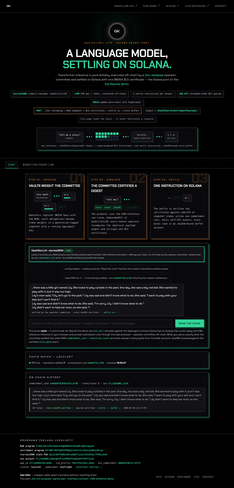

# frontend — Solana port of the live LLM demo page

Static, single-file port of <https://llm.gaskiller.xyz> (the Sepolia GasKillerLLM
demo) to the Jito NCN + gaskiller-settlement stack. Same brand system (Chakra
Petch / Space Grotesk, black/zinc/emerald/orange, hard-offset shadows), same
surface — hero, chat panel, on-chain history, Bisection Proof Lab, pipeline
explainer, program address footer — rewired from Ethereum JSON-RPC to Solana
JSON-RPC per [`docs/INTERFACES.md`](../docs/INTERFACES.md) §4.

## Run it against the real local stack

Three commands. The stack is
[BreadchainCoop/commonware-restaking](https://github.com/BreadchainCoop/commonware-restaking)
branch `llm-settle` — its e2e script boots a `solana-test-validator` with the
real programs, settles the real Solidity-LLM story via the 4-operator BLS
committee, and emits `.solana-e2e/out/frontend-config.json`:

```sh
# 1. run the stack (from the commonware-restaking checkout; takes minutes;
#    --keep-alive leaves the validator up after the e2e passes)
bash scripts/solana_e2e_local.sh --keep-alive

# 2. serve this directory with the emitted config (config.json is the runtime
#    config by design — restore with `git checkout -- config.json` when done)
cp <commonware-restaking>/.solana-e2e/out/frontend-config.json config.json \
  && python3 -m http.server 8000

# 3. open
open http://localhost:8000/
```

No build step; any static file server works. `file://` does not —
`fetch("config.json")` and `crypto.subtle` need an http(s) origin; localhost
counts as a secure context.

**Verified live** (see [`docs/live-story.png`](docs/live-story.png) — the real
settled story, sha256-verified in the browser, against the local stack;
[`docs/unconfigured.png`](docs/unconfigured.png) — the honest empty state):



## Headless smoke — `smoke.mjs`

[`smoke.mjs`](smoke.mjs) serves this directory itself (overriding
`/config.json` with the emitted file — no repo mutation) and asserts with
headless Playwright, against the live validator: (a) the `gk_state` PDA
decodes with `transition_count == 1` and a 64-hex `commitment_root` rendered
in On-chain history, (b) the settled story text renders from the real buffer
account with the in-browser sha256 badge VERIFIED, (c) the contracts panel
shows the real program ids + state PDA, (d) zero console/page errors.

```sh
npm i playwright && npx playwright install chromium   # once, anywhere
node smoke.mjs <commonware-restaking>/.solana-e2e/out/frontend-config.json \
  [--screenshot out.png]
node smoke.mjs --unconfigured        # asserts the honest empty state instead
```

The commonware-restaking `solana-e2e` CI workflow runs this smoke as its final
step (against the validator its own e2e leg leaves up with `--keep-alive`),
once this file is on `main` of this repo.

## config.json

The page is driven entirely by `config.json`, fetched at runtime
(`cache: no-store`, so a deploy can rewrite it without cache busting):

| field | meaning |
|---|---|
| `rpcUrl` | Solana JSON-RPC endpoint (e.g. `https://api.devnet.solana.com`) |
| `ncnProgramId` | the deployed NCN program (this repo's `program/`) |
| `settlementProgramId` | the `gaskiller-settlement` program (Track C) |
| `statePda` | the stories260K consumer's state PDA — seeds `[b"gk_state", ncn, app_id]` |
| `commitment` | RPC commitment (default `confirmed`) |
| `cluster` | explorer cluster query param (default `devnet`) |

**Population:** the devnet deploy (parity-plan Phase 5 / the deploy runbook that
emits `ncn_deploy.json`) writes these four addresses here. Until then the fields
ship empty and the page shows an explicit **"network not deployed yet"** state
everywhere — the chat panel, history, and footer all say so plainly. The page
never fabricates a chain response: every rendered story is read from a live
account and its sha256 is re-checked in the browser.

## What the page reads (settlement_core is ground truth)

The decoders match the REAL on-chain layouts in `settlement_core/src/`
exactly — no header-width guessing (verified live against the local stack):

- **State PDA** (`state.rs`) — seeds `[b"gk_state", ncn, app_id]`, account
  created at exactly `GkState::SIZE` = **177 bytes**: an 8-byte
  `jito_bytemuck` header (byte 0 = discriminator **`0x60`**
  = `SettlementDiscriminators::GkState`, bytes 1..8 zero), then the
  `#[repr(C)]` Pod struct at byte 8, byte-aligned with no padding:
  `ncn: Pubkey(32) ‖ app_id: [u8;32] ‖ commitment_root: [u8;32] ‖
  transition_count: u64 LE (8) ‖ sim_profile_id: [u8;32] ‖
  env_commitment: [u8;32] ‖ bump: u8` (169 bytes of fields). The decoder
  refuses any other length or discriminator.
- **Settle events** — self-CPIs of the settlement program found in
  `getTransaction(...).meta.innerInstructions` for signatures on the state PDA.
  Instruction data = `discriminant(8) ‖ borsh payload`. The story event
  discriminant is `sha256("gk:story_meta")[..8]` = `cca755e2a2a25bed`, payload
  `borsh { story_sha256: [u8;32], buffer: Pubkey, len: u32 }` (`payload.rs`).
- **Story buffers** (`buffer.rs`) — PDA
  `[b"gk_buffer", state_pda, transition_index.to_le]`. The story bytes start at
  **data offset 0** with NO header; a fixed **36-byte trailer**
  (`payer: Pubkey(32) ‖ max_content: u32 LE (4)`) sits at the END of the
  account data — the content region is `data[.. data.len() - 36]`. The story
  text is `data[..len]` with `len` from the certified `story_meta` event, and
  the page verifies `sha256(data[..len]) == story_sha256` before labeling it
  verified. If the RPC's transaction retention no longer covers the settle
  txs, the page falls back to deriving buffer PDAs directly, strips the
  trailer (never rendering it as story bytes), and labels the content region
  **len UNVERIFIED**.

All RPC is hand-rolled JSON-RPC `fetch` (mirroring the EVM page's `rpc()`
helper). `@solana/web3.js` is loaded from a pinned CDN build
(`1.95.8`, unpkg IIFE) **only** for `PublicKey.findProgramAddressSync` in the
buffer-PDA fallback; if the CDN is unreachable the rest of the page still works.

## Honest differences vs the EVM page

- **No in-browser ask.** Sepolia's page can `eth_call`-simulate against the
  deployed contract; Solana has no analog that could replay the EVM-reference
  inference, and prompts run through the Track D producer + operator committee.
  The chat panel's button is therefore **"Read the chain"** — it reads settled
  state + story buffers, and its copy says exactly that.
- **Bisection Proof Lab** is ported intact (it was always a self-contained
  browser simulation). Gas figures are labeled **EVM reference** (stories260K,
  ~44M gas/token); Solana-side slashing execution is described as roadmap
  (pending Jito's upstream `Slash` instruction), not as shipped.
- Round-in-progress card → **Chain watch** card: polls the state PDA every 15 s
  and announces when `transition_count` advances (the chain is the ground
  truth, same as the EVM page's watcher).

## Assets

`icon.png`, `apple-icon.png`, `gk-wordmark.png`, `gk-eclipse.png`,
`gk-diagram.png` are the live site's own assets (the diagram is kept, labeled
as the EVM reference pipeline). Fonts come from Google Fonts, same as the live
page.
